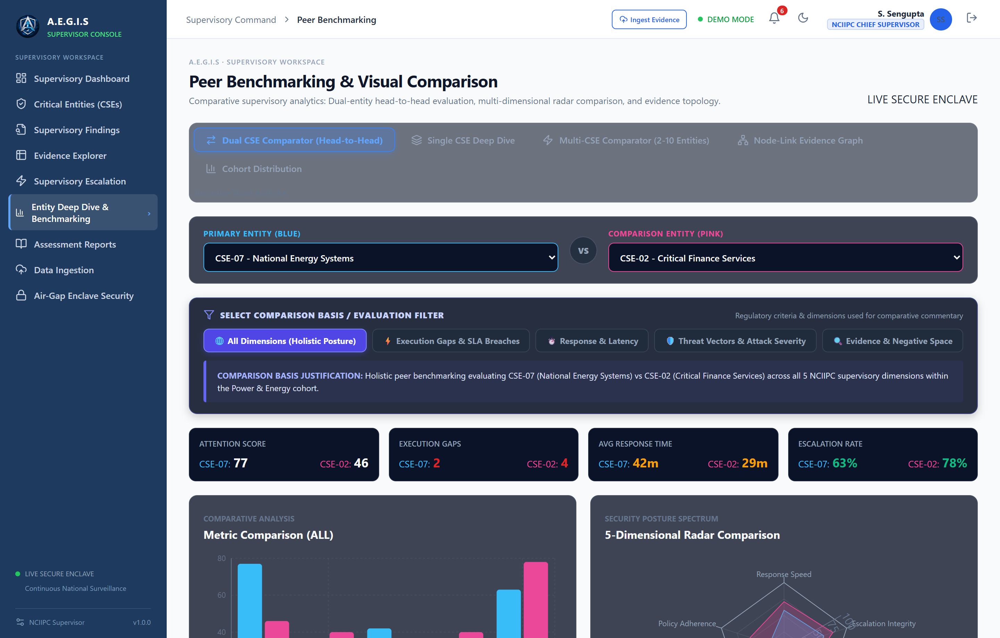
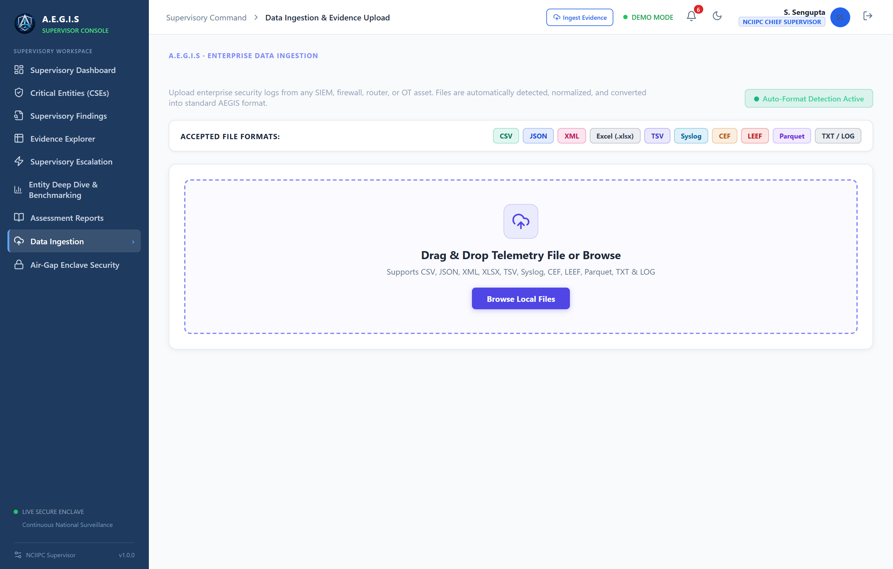
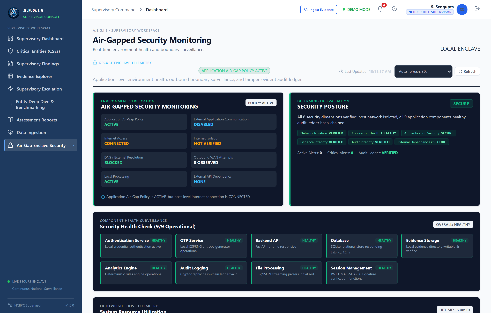
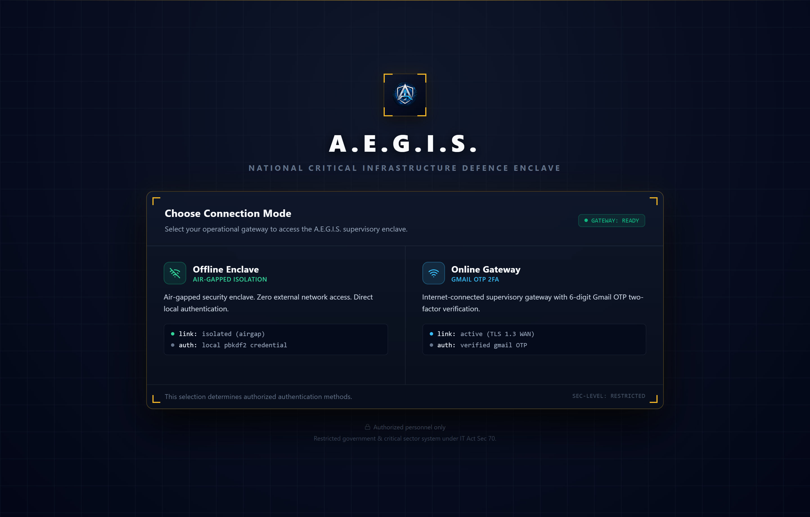
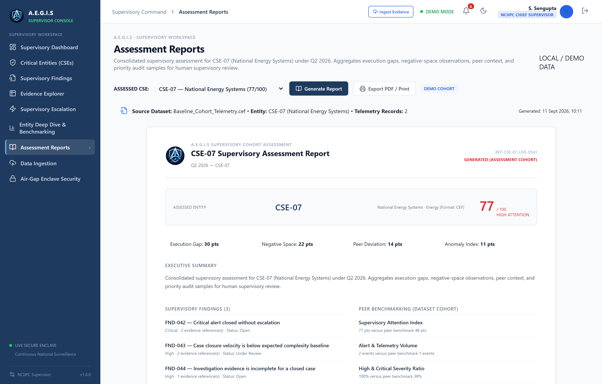
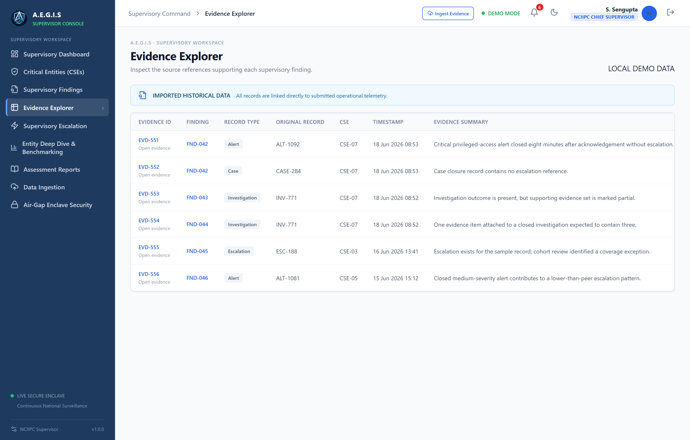
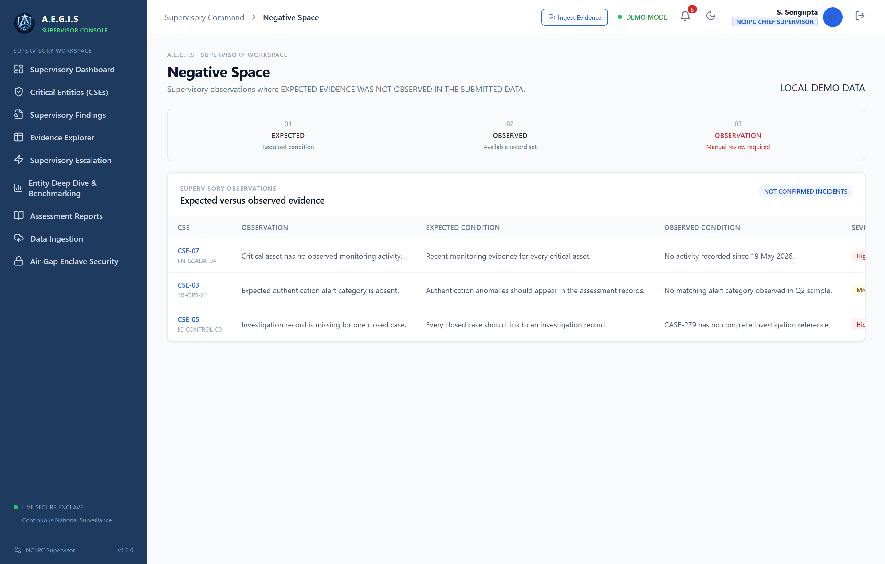
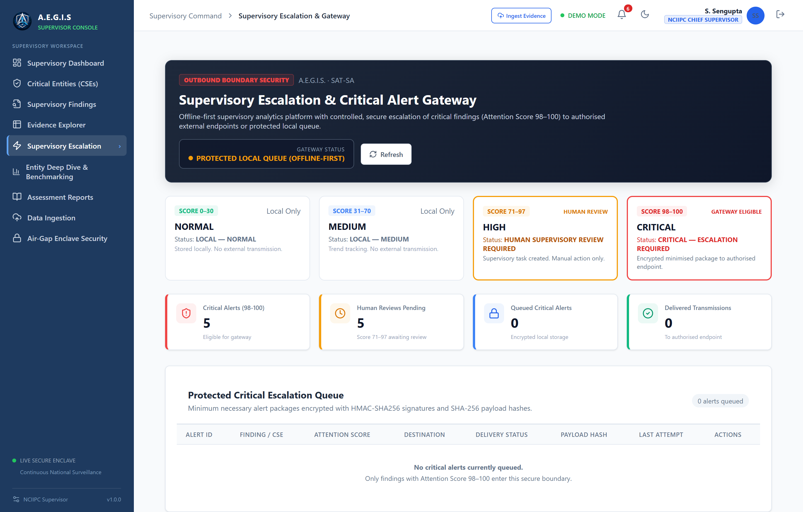
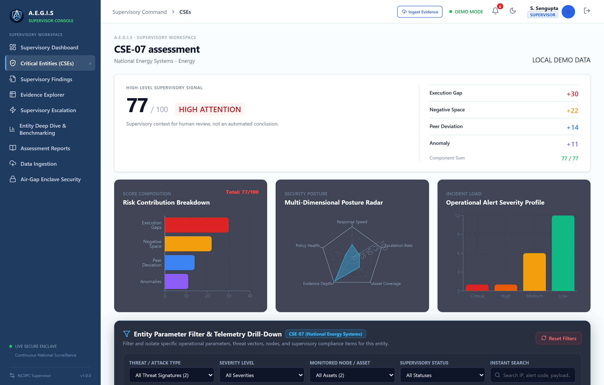

<div align="center">


# A.E.G.I.S
### Analytics & Evidence-based Governance Intelligence System
**Supervisory Analytics Tool for SOC Assessment (SAT-SA)**

<p align="center">
  <b>🏆 Smart India Hackathon (SIH 2026) · Pre-Qualifier Entry</b><br>
  <b>Problem Statement ID:</b> <code>SIH26157</code> | <b>Theme:</b> <code>Blockchain & Cybersecurity</code> | <b>Category:</b> <code>Software</code><br>
  <b>Organization:</b> <code>National Technical Research Organisation (NTRO)</code><br>
  <b>Team:</b> <code>CODER RISE (TID-074)</code> | <b>Institution:</b> <code>Galgotias University</code>
</p>

[](https://fastapi.tiangolo.com)
[](https://react.dev)
[](https://vitejs.dev)
[](https://python.org)
[](https://www.postgresql.org)
[]()
[](LICENSE)

<p align="center">
  <b>A deterministic, evidence-grounded supervisory intelligence platform designed for periodic Security Operations Center (SOC) operational audits, execution-gap discovery, negative-space reasoning, and peer-benchmarked governance.</b>
</p>

</div>

---

## 📑 Table of Contents
- [🌟 Executive Overview](#-executive-overview)
- [🎯 SIH Problem Statement Alignment (NTRO)](#-sih-problem-statement-alignment-ntro)
- [🏗️ System Architecture & Data Flow](#️-system-architecture--data-flow)
- [🚀 Key Modules & Capabilities](#-key-modules--capabilities)
- [🖼️ Comprehensive Visual Showcase (All 10 Core Views)](#️-comprehensive-visual-showcase-all-10-core-views)
- [⚡ Quickstart & Installation Guide](#-quickstart--installation-guide)
- [🔒 Air-Gapped & Offline Deployment](#-air-gapped--offline-deployment)
- [📡 API Documentation Reference](#-api-documentation-reference)
- [📂 Repository Structure](#-repository-structure)
- [🛡️ Security, Privacy & Integrity](#️-security-privacy--integrity)
- [👥 Project Team & Credits](#-project-team--credits)

---

## 🌟 Executive Overview

In large-scale critical national infrastructures (CNIs) and sectoral regulatory bodies (e.g., NTRO, NCIIPC, CERT-In, RBI, SEBI), supervising multiple Critical Sector Entities (CSEs) is challenging. Regulators face:
1. **Asymmetric Evidence Quality**: Disparate telemetry across distinct SIEM formats (ArcSight, QRadar, Splunk, Elastic).
2. **Supervisory Blindspots**: Inability to detect *negative space* (what the SOC *failed* to log, detect, or escalate).
3. **Execution Gaps**: Playbook non-compliance, delayed incident containment, and unverified alert closures.

**A.E.G.I.S.** solves this by delivering an **offline-first, evidence-traceable supervisory analytics engine**. Rather than replacing SIEMs or acting as a continuous real-time monitor, A.E.G.I.S. ingests periodic operational snapshots, normalizes heterogenous telemetry, calculates bounded composite Attention Scores (0–100), and equips human supervisors with transparent, mathematically defensible audit trails.

---

## 🎯 SIH Problem Statement Alignment (NTRO)

**Problem Statement ID:** `SIH26157`  
**Organization / Ministry:** National Technical Research Organisation (NTRO)  
**Theme:** Blockchain & Cybersecurity (Software Edition)

| SIH Requirement | A.E.G.I.S. Implementation | Status |
|---|---|:---:|
| **Supervisory Assessment Support** | Multi-CSE entity scoring, prioritization engine, and supervisory decision room | ✅ Implemented |
| **Execution Gap Analysis** | Rule-driven playbook compliance, containment verification, and closure checks | ✅ Implemented |
| **Negative-Space Discovery** | Detection of missing log sources, silent intervals, and unobserved indicators | ✅ Implemented |
| **Anomaly & Outlier Detection** | Statistical baseline deviation, sudden volume shifts, and atypical response times | ✅ Implemented |
| **Peer Benchmarking** | Normalized cross-CSE radar comparison across critical sector peers | ✅ Implemented |
| **Evidence Traceability** | 100% deterministic finding-to-raw-event audit trail with zero synthetic hallucinations | ✅ Implemented |
| **Universal SIEM Normalization** | Built-in parsers for CEF, LEEF, Syslog, XML, Parquet, JSON, and XLSX | ✅ Implemented |
| **Air-Gapped / Offline Operation** | Zero runtime internet or external cloud dependencies; local SQLite/PostgreSQL | ✅ Implemented |
| **Cryptographic Accountability** | Outbound HMAC-SHA256 critical alert signing & sequential chained audit logs | ✅ Implemented |

---

## 🏗️ System Architecture & Data Flow

```
┌────────────────────────────────────────────────────────────────────────────────────────┐
│                        PERIODIC CSE EVIDENCE / SOC LOG INGESTION                       │
│  [CEF - ArcSight]  [LEEF - QRadar]  [Syslog RFC-5424]  [XML]  [Parquet]  [JSON]  [XLSX]│
└───────────────────────────────────────────┬────────────────────────────────────────────┘
                                            │
                                            ▼
┌────────────────────────────────────────────────────────────────────────────────────────┐
│                         UNIVERSAL NORMALIZATION & ETL ENGINE                           │
│     • Schema Validation & Type Coercion   • Elastic Common Schema (ECS) Normalizer     │
│     • Batch Ingestion Ledger              • Missing Field & Null Imputation Handler    │
└───────────────────────────────────────────┬────────────────────────────────────────────┘
                                            │
                                            ▼
┌────────────────────────────────────────────────────────────────────────────────────────┐
│                          SUPERVISORY ANALYTICAL CORE                                   │
│  ┌────────────────────────┐  ┌────────────────────────┐  ┌───────────────────────────┐ │
│  │  Execution Gap Engine  │  │ Negative-Space Engine  │  │ Anomaly & Outlier Engine  │ │
│  │ (Playbook Violations)  │  │ (Missing Logs/Signals) │  │ (Statistical Deviations)  │ │
│  └───────────┬────────────┘  └───────────┬────────────┘  └─────────────┬─────────────┘ │
│              └───────────────────────────┼─────────────────────────────┘               │
│                                          ▼                                             │
│  ┌───────────────────────────────────────────────────────────────────────────────────┐ │
│  │         COMPOSITE ATTENTION SCORING & PRIORITIZATION ENGINE (0 - 100)             │ │
│  │  • [0 - 30]: NORMAL      • [31 - 70]: MEDIUM     • [71 - 97]: SUPERVISORY REVIEW  │ │
│  │  • [98 - 100]: CRITICAL ESCALATION REQUIRED                                      │ │
│  └───────────────────────────────────────┬───────────────────────────────────────────┘ │
└───────────────────────────────────────────┼────────────────────────────────────────────┘
                                            │
                        ┌───────────────────┴───────────────────┐
                        ▼                                       ▼
┌──────────────────────────────────────────────┐ ┌──────────────────────────────────────┐
│       EXECUTIVE SUPERVISORY FRONTEND         │ │     SECURE OUTBOUND GATEWAY          │
│  • Executive Decision Room & Drilldowns      │ │  • Gatekeeper (Score >= 98 Only)     │
│  • Multi-CSE Radar Comparator                │ │  • Data Minimisation (14 Fields Max) │
│  • Air-Gap Posture & Host Telemetry          │ │  • Cryptographic HMAC-SHA256 Sign    │
│  • Case Management & Audit Ledger            │ │  • Idempotency & Replay Shield       │
└──────────────────────────────────────────────┘ └──────────────────────────────────────┘
```

---

## 🚀 Key Modules & Capabilities

### 1. 🛡️ Executive Decision Room
- **Bounded Attention Scores (0–100)**: Transparent, deterministic scoring based on observed operational findings.
- **Dynamic Tiering**:
  - `0 – 30`: **NORMAL** (Autonomous local logging)
  - `31 – 70`: **MEDIUM** (Local supervisory queue)
  - `71 – 97`: **HIGH** (Mandatory Human Supervisory Review)
  - `98 – 100`: **CRITICAL** (Immediate Critical Escalation Gateway trigger)

### 2. 📊 Multi-CSE Comparative Benchmarking
- Normalized multi-axis radar comparisons across peer entities in Energy, Finance, Defense, Telecom, and Health.
- Identifies systemic sector-wide blindspots and individual organizational anomalies.

### 3. 🔍 Execution Gap & Negative-Space Discovery
- **Execution Gaps**: Detects containment delays, skipped containment playbooks, unverified resolved statuses, and off-hour response lapses.
- **Negative-Space Analysis**: Identifies absence of expected telemetry (e.g., DNS queries missing during active malware alerts, missing firewall flow logs).

### 4. 🌐 Universal SIEM Normalization Engine
- Real-time ingestion and lossless translation across **8+ standard formats**:
  - ArcSight Common Event Format (`.cef`)
  - IBM QRadar Log Event Extended Format (`.leef`)
  - Standard Syslog (`RFC-5424` / `RFC-3164`)
  - Windows Event Log & XML (`.xml`)
  - Apache Parquet columnar storage (`.parquet`)
  - Excel Worksheets (`.xlsx`) & Structured JSON / CSV

### 5. 🔒 Air-Gapped Enclave & Outbound Security Gateway
- **Dual Isolation Mode**: Built-in air-gapped detection guarantees zero unapproved outbound network requests.
- **Cryptographic Audit Chain**: SHA-256 sequential hash chaining ensures an immutable, tamper-evident audit ledger.
- **Critical Alert Gatekeeper**: Outbound alerts are subjected to strict data minimization (transmitting only 14 essential metadata fields) and signed with HMAC-SHA256.

### 6. 👥 Dual Authentication & Role-Based Access Control (RBAC)
- **Role Separation**: `SUPERVISOR`, `ANALYST`, `ADMINISTRATOR`, `AUDITOR`.
- **Authentication**: Seamless dual-mode authentication supporting Google OAuth 2.0 and offline CSPRNG-generated Gmail OTP verification.

---

## 🖼️ Comprehensive Visual Showcase (All 10 Core Views)

<div align="center">

### 1. Executive Decision Room & Bounded Attention Scoring
*Real-time executive cockpit displaying supervisory attention breakdown, critical findings, and entity posture.*


---

### 2. Multi-CSE Comparative Radar & Sectoral Benchmarking
*Cross-entity radar analytics comparing PowerGrid, IOCL, SBI, Airtel, and AIIMS against national cohort medians.*


---

### 3. Universal SIEM Ingestion & Normalization Engine
*Multi-format ingestion pipeline supporting CEF, LEEF, Syslog, XML, Parquet, JSON, and XLSX with live schema conversion.*


---

### 4. Air-Gapped Security Monitoring & Cryptographic Ledger
*Host isolation telemetry, component health surveillance, and sequential SHA-256 audit log integrity verification.*


---

### 5. Dual-Mode Enterprise Authentication Portal
*Air-gapped enclave login with Google OAuth 2.0 and offline CSPRNG-generated Gmail OTP verification.*


---

### 6. Automated Supervisory Assessment Report (CSE-07)
*Deterministic regulatory report generation with evidence traceability, peer comparisons, and supervisory guidance.*


---

### 7. Evidence Traceability & Operational Drilldown
*Signal-to-evidence flow tracing raw submitted SOC events directly to analytical findings without hallucinations.*


---

### 8. Negative-Space & Missing Telemetry Analysis
*Mathematical identification of missing log sources, silent operational windows, and skipped forensic artifacts.*


---

### 9. Outbound Critical Alert Escalation Gateway
*Strict data-minimized outbound dispatch with cryptographic HMAC-SHA256 signature and idempotency safeguards.*


---

### 10. Single CSE Entity Operational Deep-Dive
*Detailed operational telemetry analysis and chronological alert lifecycle for PowerGrid SOC (CSE-07).*


</div>

---

## ⚡ Quickstart & Installation Guide

### Prerequisites
- **Python**: `3.12+` (with `pip`)
- **Node.js**: `18.0+` (with `npm` or `pnpm`)

---

### 🚀 Option A: One-Click Startup (Recommended for Windows)

Simply double-click the included batch script in the root directory:
```powershell
.\START_PROJECT.bat
```
*This automatically sets up Python virtual environments, applies SQLite migrations, seeds demo datasets, starts both FastAPI (Port 8000) and Vite (Port 3000), and opens the dashboard.*

To stop all services gracefully:
```powershell
.\STOP_PROJECT.bat
```

---

### 🛠️ Option B: Manual Installation

#### 1. Clone the Repository
```bash
git clone https://github.com/prateekg883/AEGIS-SIH26157.git
cd AEGIS-SIH26157
```

#### 2. Backend Setup
```bash
# Create and activate virtual environment
python -m venv backend/.venv

# Windows:
backend\.venv\Scripts\activate
# Linux/macOS:
source backend/.venv/bin/activate

# Install dependencies
pip install -r backend/requirements.txt

# Run database migrations
cd backend
alembic upgrade head
cd ..

# (Optional) Seed demo records
powershell .\scripts\setup_demo.ps1
```

#### 3. Frontend Setup
```bash
# Install node dependencies
npm install

# Build or start development server
npm run dev
```

#### 4. Access the Application
- **Frontend Dashboard**: `http://localhost:3000`
- **Backend Swagger API Docs**: `http://127.0.0.1:8000/docs`
- **Default Offline Supervisor Credentials**:
  - **Username**: `supervisor01`
  - **Password**: `Admin@2026`
  - **Role**: `SUPERVISOR`

---

## 🔒 Air-Gapped & Offline Deployment

A.E.G.I.S. is engineered specifically for secure, air-gapped supervisory rooms with zero internet connectivity.

1. **Pre-download Offline Wheels** (on internet-connected machine):
   ```powershell
   .\scripts\prepare_offline_dependencies.ps1
   ```
2. **Transfer via Secure Media** to the air-gapped workstation.
3. **Install Offline Dependencies**:
   ```powershell
   .\scripts\install_offline_dependencies.ps1
   ```
4. **Validate Air-Gap Posture**:
   ```powershell
   .\scripts\validate_offline_deployment.ps1
   ```

*Detailed air-gapped guidelines are available in [`docs/OFFLINE_DEPLOYMENT.md`](docs/OFFLINE_DEPLOYMENT.md).*

---

## 📡 API Documentation Reference

The FastAPI backend provides structured REST endpoints with OpenAPI validation:

| Route Prefix | Method | Description |
|---|:---:|---|
| `/api/auth/` | `POST` | Authentication (Google OAuth + Gmail OTP Verification) |
| `/api/ingestion/` | `POST` | Ingest periodic SOC logs (CSV, JSON, XML, CEF, LEEF) |
| `/api/normalization/` | `POST` | Convert heterogenous SIEM formats into normalized standard schemas |
| `/api/analytics/attention/` | `GET` | Calculate and retrieve composite Attention Scores per CSE |
| `/api/analytics/gaps/` | `GET` | Query detected execution gaps and playbook discrepancies |
| `/api/analytics/negative-space/` | `GET` | Query negative-space telemetry observations |
| `/api/analytics/multi-cse/` | `GET` | Retrieve cross-entity comparative metrics and radar data |
| `/api/gateway/escalate/` | `POST` | Outbound Critical Alert Gateway (HMAC-SHA256 signed package) |
| `/api/security/telemetry/` | `GET` | Host isolation telemetry, audit chain status, and enclave health |
| `/api/reports/` | `GET/POST`| Generate comprehensive supervisory audit reports |

---

## 📂 Repository Structure

```text
AEGIS/
├── assets/
│   ├── logo.png                       # Official A.E.G.I.S. Logo
│   └── screenshots/                   # All 10 high-resolution dashboard screenshots
│       ├── 01_decision_room.png
│       ├── 02_multi_cse_comparator.png
│       ├── 03_data_ingestion_siem.png
│       ├── 04_airgap_security.png
│       ├── 05_login_portal.png
│       ├── 06_supervisory_report.png
│       ├── 07_evidence_investigation.png
│       ├── 08_negative_space.png
│       ├── 09_critical_escalation.png
│       └── 10_cse_deepdive.png
├── backend/
│   ├── alembic/                       # Database schema versioning & migrations
│   ├── app/
│   │   ├── analytics/                 # Execution gap, negative space & scoring engines
│   │   ├── api/                       # FastAPI REST route controllers
│   │   ├── core/                      # Config, security, JWT & hashing utilities
│   │   ├── db/                        # SQLAlchemy session and connection engine
│   │   ├── gateway/                   # Outbound Critical Alert Gateway & HMAC signer
│   │   ├── ingestion/                 # Log ingestors and batch processors
│   │   ├── normalization/             # SIEM format converters (CEF, LEEF, Syslog, etc.)
│   │   ├── models/                    # Database ORM entity models
│   │   ├── reports/                   # Audit report generators
│   │   └── main.py                    # FastAPI application entrypoint
│   └── requirements.txt               # Pinned Python dependencies
├── client/
│   ├── public/                        # Static web assets & icons
│   └── src/
│       ├── components/                # React dashboard modules (Decision Room, Radar, etc.)
│       ├── services/                  # API communication layer
│       ├── App.jsx                    # Root React component & layout router
│       └── main.jsx                   # React 19 bootstrap
├── docs/                              # In-depth technical documentation
│   ├── presentation/                  # SIH presentation slides (.pptx)
│   ├── OFFLINE_DEPLOYMENT.md          # Comprehensive air-gap guide
│   ├── SIH_REQUIREMENT_MAPPING.md     # Problem statement mapping matrix
│   ├── SIEM_INTEGRATION_REPORT.md     # SIEM connector technical specifications
│   └── MVP_VALIDATION_REPORT.md       # Quality assurance & test verification log
├── sample_data/
│   ├── sample_arcsight.cef            # Sample CEF ArcSight log
│   ├── sample_qradar.leef             # Sample LEEF QRadar log
│   ├── sample_soc_events.xml          # Sample XML log
│   ├── sample_analytics.parquet       # Sample Parquet file
│   └── datasets/                      # Multi-record synthetic SOC & normalization datasets
├── scripts/
│   ├── setup_demo.ps1                 # Seed database with CSE demonstration data
│   ├── start_backend.ps1              # Start backend service
│   ├── start_frontend.ps1             # Start frontend client
│   └── check_health.ps1               # Automated end-to-end API health checker
├── START_PROJECT.bat                  # One-click Windows startup script
├── STOP_PROJECT.bat                   # One-click Windows shutdown script
├── verify_aegis_system.py             # Automated 30-point test verification suite
└── README.md                          # Master project documentation
```

---

## 🛡️ Security, Privacy & Integrity

1. **Zero External Cloud Telemetry**: All processing, feature extraction, scoring, and storage remain strictly local to the deployed enclave.
2. **Deterministic Analysis**: Eliminates probabilistic hallucinations; all insights are mathematically derived from verified evidentiary logs.
3. **Cryptographic Proofs**: Audit logs are hashed sequentially with SHA-256 to ensure non-repudiation during supervisory reviews.
4. **Data Minimization**: Outbound escalation packets strip sensitive payload contents and retain only 14 essential supervisory metadata fields.

---

## 👥 Project Team & Credits

### Smart India Hackathon (SIH 2026)
- **Problem Statement ID**: `SIH26157`
- **Theme**: Blockchain & Cybersecurity (Software Edition)
- **Organization**: National Technical Research Organisation (NTRO)
- **Institution**: Galgotias University
- **Table No**: `Table-022`
- **Team ID**: `TID-074`
- **Team Name**: **CODER RISE**

### Core Team
| Name | Role / Focus Area | Profile / Contact |
|---|---|---|
| **Prateek Gupta** *(Team Leader)* | Full-Stack & Supervisory Analytics Architecture | [](https://www.linkedin.com/in/prateek-gupta-tech/) |
| **Team Member 2** | Backend & SIEM Normalization Engine | Galgotias University |
| **Team Member 3** | Frontend & Decision Room Visualization | Galgotias University |
| **Team Member 4** | Threat Modeling & Negative-Space Logic | Galgotias University |
| **Team Member 5** | Cryptographic Audit & Gateway Security | Galgotias University |
| **Team Member 6** | System Validation & Air-Gapped Deployment | Galgotias University |

---

<div align="center">
  <sub>Built with precision for the Smart India Hackathon 2026 · <b>Team CODER RISE (TID-074) · Galgotias University</b></sub><br>
  <sub><b>A.E.G.I.S.</b> — Safeguarding National Critical Information Infrastructure</sub>
</div>
